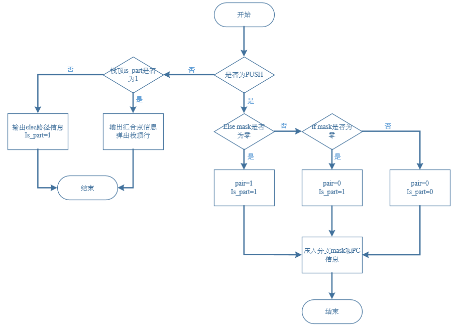

# 指令精度仿真

## 进度

代码更新在下面分支

(https://git.tsinghua.edu.cn/gpu-dsplab/riscv-isa-sim-gpgpu/-/tree/simt-stack)

**已完成**

- 了解simt stack

- 阅读spike代码
  
  - 确定simt stack数据结构
  
  - 完成simt stack在processor.h里面的接口
  
  - 大致确定rvv 拓展的mask代码定位和运行逻辑
  
  - simt stack相关函数完成
  
  - join等自定义指令完成

**正在进行**

测试单warp可否执行

调研多warp

- Interleaving Instructions 改成1

- barrier指令（类似beq东西）

- shared memory 放data

**问题**

目前多warp有哪些问题需要解决？

- 数据同步
  
  - 需要同步的东西
  
  - simt stack？
  
  - data

- shared memory的定位，约好一个位置？

# 具体实现

## 多warp部分

### 同步

缓存方面：

shared memory

global memory要同步到shared memory上完成多warp同步

需要同步的东西：

- simt stack


shared memory代码定位

mmu.h

mmu.cc

看起来是通过mmu直接访问地址，没有做memory划分？

没有一个shared memory，所以要固定好一个位置共享吗？

### 网上资料

[multi core for spike](https://techroose.com/tech/spikeMulticore.html)

[GitHub - poweihuang17/Documentation_Spike: Documentation for RISC-V Spike](https://github.com/poweihuang17/Documentation_Spike)

[[RISC-V Architecture Training] @DEMO: PK (proxy kernel) and FESVR (front-end server) - When Moore&#39;s Law ENDS](https://phdbreak99.github.io/riscv-training/12-demo.syscall/)

## 单warp部分

汇编部分：

首先是指令部分要包含simt的汇合点，这部分是指令集和解码要配合

### 指令解释

join vs2,imm,offset

| off[12\|10:5] | vs2 | vs1 | 011 | off[4:1\|11] | 0001011 |     |     |
| ------------- | --- | --- | --- | ------------ | ------- | --- | --- |

- 解释：遇到join直接检查simt stack根据栈顶的内容判断一下是执行PC+4的指令/执行PCelse指令/执行join指令

- vs2，imm没意义，offset代表当前指令和汇合点的偏移量

### simt stack实现

在processor.h里面

struct simt_stack_entry_t

| is_part              | int    | 标记和选择最终的输出有效信息信息           |
| -------------------- | ------ | -------------------------- |
| rPC                  | string | 汇合点pc                      |
| r_mask               | int    | 汇合点mask，（嵌套情况为上一分支的if mask |
| else_mask            | int    | else部分的mask                |
| else_pc              | string | else部分的地址                  |
| pair                 | int    | else路径掩码是否为0               |
| simt_stack_entry_t() |        | 构造函数                       |
| void print()         |        | 输出全部信息                     |

class simt_stack_t

| public                                                  |                           |                   |
| ------------------------------------------------------- | ------------------------- | ----------------- |
| pop()                                                   | void                      | 删除栈顶元素但不返回其值      |
| top()                                                   | simt_stack_entry_t*       | 返回栈顶的元素           |
| size()                                                  | simt_stack_entry_t*       | 栈中元素的个数           |
| push_branch(if_pc, if_mask, r_mask, else_pc, else_mask) | void                      | simt stack压栈操作和逻辑 |
| pop_join(reg_t r_pc)                                    | void                      | 执行join指令逻辑        |
| get_mask                                                | uint64_t                  | 获得栈顶的mask         |
| get_npc()                                               | reg_t                     | 获得next pc         |
| get_npc()                                               |                           | 获得栈顶pc            |
|                                                         |                           |                   |
| private                                                 |                           |                   |
| _stack                                                  | stack<simt_stack_entry_t> | 栈                 |
| npc                                                     |                           | next pc           |
| mask                                                    |                           | mask              |

v_ext_macros.h

### 代码对应结构

| processor.h                 | 定义simt stack硬件 |     |
| --------------------------- | -------------- | --- |
| insns底下                     | 定义不同指令功能       |     |
| processor_t::step(size_t n) | 一次执行n行指令       |     |
|                             |                |     |
|                             |                |     |

### processor_t 代码结构

| state   | architectural state of a RISC-V hart       | csr寄存器，pc都定义在里面 |
| ------- | ------------------------------------------ | --------------- |
| instret |                                            |                 |
| mmu     | main memory is always accessed via the mmu | mmu_t*          |
|         |                                            |                 |
|         |                                            |                 |
|         |                                            |                 |

### processor_t::step(size_t n)结构：

| size_t instret = 0  | unsigned long |     |
| ------------------- | ------------- | --- |
| reg_t pc = state.pc |               |     |
| mmu_t* _mmu = mmu;  |               |     |
|                     |               |     |
|                     |               |     |
|                     |               |     |

### struct state结构：

| pc           | uint64_t  |                                                |
| ------------ | --------- | ---------------------------------------------- |
| XPR          | regfile_t |                                                |
| FPR          | regfile_t |                                                |
| STEP_STEPPED |           |                                                |
| serialized   | bool      | whether timer CSRs are in a well-defined state |
|              |           |                                                |

### 补充知识

likely和unlikely https://meetonfriday.com/posts/cecba4ef/

likely(x) = (x==ture), 为加速用法，這段敘述(x)為true的機率比較大(比較常發生)，告訴compiler將x==ture的對應執行程式碼接在判斷後面

```
#stack
s.empty()               如果栈为空返回true，否则返回false
s.size()                返回栈中元素的个数
s.pop()                 删除栈顶元素但不返回其值
s.top()                 返回栈顶的元素，但不删除该元素
s.push()                在栈顶压入新元素
```

#define中，#的作用

[c/c++ 宏中&quot;#&quot;和&quot;##&quot;的用法 - 腾讯云开发者社区-腾讯云](https://cloud.tencent.com/developer/article/1021538)

##：连接两个宏参数

ex：#define CONS(a,b) int（a##e##b) => CONS(2,3)=2e3=2000

# 任务要求

- 仿真内容：记录每条指令执行过程中，ISA寄存器（即32个标量32个浮点32个向量）、CSR、Memory的变化。不要求实现异常中断处理，不要求特权等级。

- 支持指令：对单warp支持rv32I M F和vector指令的执行，支持自定义SIMT-stack的执
  行。对多warp支持启动、退出与简单同步。

- single step
  register/memory examination 再加个“快进（跳转到指定pc位置）

推荐任务进度

  先尝试运行开源代码，尝试运行RV32I的汇编，并测试基本输出功能
  添加单warp功能（即带vector的执行），添加寄存器，添加基本向量指令
  添加SIMT-stack相关硬件单元，实现mask功能
  添加多warp功能，调试运行现成的gaussian汇编程序
  后续的bfs汇编测试，在测试中基于现有框架添加和验证更多指令

# SIMT STACK 理论

SIMT-Stack: 用于解决同一个warp内分支问题，通过mask 在分支执行过程中，将不需要执行的线程通过mask 去掉。

#### 具体流程

Fetch模块根据PC指向的指令从内存中获取到相应的指令（PC指针指向的指令是下一个将要执行的指令），之后SIMT将获取到的指令进行译码，并根据译码之后的结果从register file从获取到寄存器，与此同时 SIMT 进行mask处理，在接下来的处理流程中，根据SIMT mask结果，进行预测，哪些线程(core)将会执行。
[关于GPU一些笔记（SIMT方面)_Huo的藏经阁的博客-CSDN博客_simt架构](https://blog.csdn.net/weixin_42730667/article/details/109838089)

SIMT stack模块使用mask来进行标记，其中置为1表示该线程需要执行，置0表示该线程不需要执行，每一个bit位代表了一个线程。warp大小为4 即同时支持4个线程并行运行

ex：A 1111    B 1110

GPU上述执行遇到上述分支时，只能采取顺序执行，即先执行其中一个分支然后再执行另外一个分支，当执行其中一个分支时 根据提前标记好的mask决定线程是否运行


在SIMT stack中为了指明整个序列号执行路径，按照一条条entry记录，使用类似如下图所示内容



#### 压栈逻辑

遇到分支时，先将此分支的汇合点压入栈，接着将两个分支压入栈

- 遇到分支时，更改TOS的PC项为分支结束时的PC值，并且依照次序将对应if、else的程序段相关信息压入栈内，也即在分支发生时，SIMT stack需要获得掩码（mask）信息、if-else程序段的起始PC值信息、分支结束点的PC值信息；

- 程序总是调度SIMT stack的TOS对应程序段执行，也即发生分支时，程序执行顺序有一定确定性，在上例中为A-B-C-D-E-F-G；

- 判断分支程序段是否到达汇合点的依据为当前正在执行的PC值是否与TOS的rPC项相等

### 此时大概会有两个question：

- 如何知道汇合点指令：
  
  - 汇合点指令是编译器添加的，在if语句和else语句结束的位置都添加

- 如何分辨哪个分支先压入栈：分支压栈顺序按照执行顺序
  
  - 后续进阶可以有分支预测

## 硬件实现

测试代码

https://git.tsinghua.edu.cn/yff18/testcase-reduction

首先是汇编代码


处理逻辑

上面的汇编代码省去了一些分支相关的指令，这些指令会根据nvidia不同加购在下一个层次汇编sass(似乎是)里面添加（包含汇合点


要支持的指令


simt stack 硬件实现


双数据存储结构（即在同一行内，同时存储else路径信息和汇合点信息）

| is_part:   | 标记和选择最终的输出有效信息信息           |
| ---------- | -------------------------- |
| rPC:       | 汇合点pc                      |
| rMASK：     | 汇合点mask，（嵌套情况为上一分支的if mask |
| MASK else： | else部分的mask                |
| PC else：   | else部分的地址                  |
| pair：      | else路径掩码是否为0               |

rMASK：

对于单个线程和特定的分支，有可能两个都不执行因此需要rMask作为记录处理嵌套问题

比如if分支内部再出现分支时，rmask其实就是上一分支的if mask

is_part:

标记和选择最终的输出有效信息信息，is_part为0时，输出为栈顶else路径信息，is_part为1时，输出为栈顶汇合点信息

## SIMT MASK

个人猜想：

我认为mask就是在warp中的不同分支，在遇到分支时，计算一下，将是否需要算下一个分支给算出来

具体硬件应该为组合逻辑

## Advance problem

专利 《Execution of divergent threads using a convergence barrier》

**dead lock**

对于一个程序来说，如果出现分支就意味这每个分支的指令和处理不一致，这就容易造成对一些共享的数据的一致性，失去一致性就意味着在同一个warp内的如果存在分支则线程之间不能够交互或者交互数据，在一些实际算法中为了进行数据交互 则需要使用lock机制，而mask恰恰会因为调度问题造成一个死锁deadlock问题.

example: 当在warp内遇到对同一个位置的共享变量进行操作

而cuda提供了atomic原子操作一系列操作，避免对同一资源进行同时访问修改，atomic相当于一个自旋锁。

```
__global__ kernel() {
  __shared__ int semaphore;
  semaphore=0;
  __syncthreads();
  while (true) {
    int prev=atomicCAS(&semaphore,0,1);
    if (prev==0) {
      //critical section
      semaphore=0;
      break;
    }
  }
}
```

V100 中NV 为warp内每个线程都分配了一个PC指针和Stack，这样将PC指针的颗粒度细化到了每一个线程中去，但是这样就于GPU 的根基SIMT执行模型又有明显的冲突，因为这样每个线程都有自己的PC，岂不是和CPU没什么本质上的差别。为了解决上述问题，在V100内部调用中，硬件还是使用的warp这一单位进行调度线程，V100内部中使用了a schedule optimizer硬件模块决定哪些线程可以在一个warp内进行调度

将分支组织成一个sub-warp来保证处于同一分支的在同一个sub-warp内

**Barrier Participation Mask**

用来跟踪维护哪些线程归属于哪个convergence barrier，因为在一个kernel中可能会存在多个分支，意味着会出现多个 convergence barrier， 线程会一直根据Participation Mask进行等待 直到都达到了common point(类似于reconvergence point ).

- Barrier State用于跟踪哪些线程达到了convergence barrier状态。

- Thread State用来记录线程状态，处于active状态还是处于block状态等。

- Thread rPC: 线程要执行的下一个指令

- Thread Active:记录线程是否处于激活状态。

上述各个entry大小于warp相关，如果warp为32个，则各自都有32个信息。

该专利中给出了明确执行流程，通过 convergence barrier产生一个额外的等待分支，知道 convergence barrier执行之后才进行下一个分支执行。

# RVV mask

## 具体流程

v拓展指令格式

| Bits     | Name       | Description                                     |
| -------- | ---------- | ----------------------------------------------- |
| XLEN-1   | vill       | Illegal value if set                            |
| XLEN-2:8 | 0          | Reserved if non-zero                            |
| 7        | vma        | Vector mask agnostic(是否启用)                      |
| 6        | vta        | Vector tail agnostic                            |
| 5:3      | vsew[2:0]  | Selected element width (SEW) setting            |
| 2:0      | vlmul[2:0] | Vector register group multiplier (LMUL) setting |

## 代码定位

**mask定义：**

在processor.h中的

```
struct insn_desc_t  //mask
{
  insn_bits_t match;
  insn_bits_t mask; //推测为mask    
  insn_func_t rv32i;
  insn_func_t rv64i;
  insn_func_t rv32e;
  insn_func_t rv64e;
```

在class processor t里面也有定义

std::vector<insn_desc_t> instructions;

在vsetvli.h里面为

```
require_vector_novtype(false, false);
WRITE_RD(P.VU.set_vl(insn.rd(), -1, insn.rs1(), insn.v_zimm10()));
```

mask的操作应该是在decode的部分进行的

**mask如何计算出来**

**mask使用**

在processor_t::decode_insn(insn_t insn)里面使用了mask判断是否执行指令

processor_t::vectorUnit_t::reset() 里面将csr的mask从新归零

故应该是在我们自己写的join指令里面直接使用processor_t对象里的insn_bits_t mask即可
