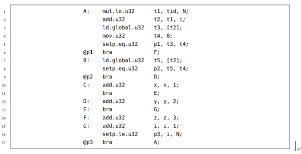
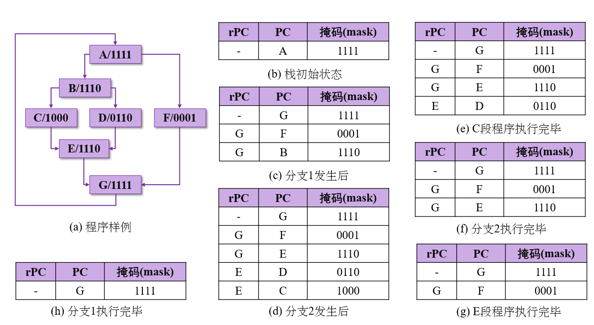
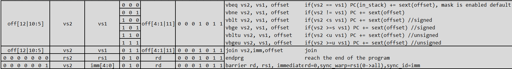
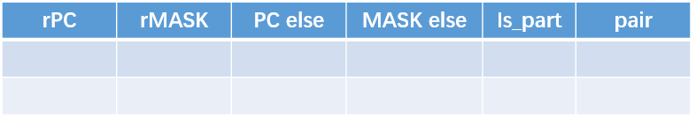

# 指令精度仿真

# question

1 


## 任务要求

- 仿真内容：记录每条指令执行过程中，ISA寄存器（即32个标量32个浮点32个向量）、CSR、Memory的变化。不要求实现异常中断处理，不要求特权等级。

- 支持指令：对单warp支持rv32I M F和vector指令的执行，支持自定义SIMT-stack的执
  行。对多warp支持启动、退出与简单同步。

- single step
  register/memory examination 再加个“快进（跳转到指定pc位置）

推荐任务进度

  先尝试运行开源代码，尝试运行RV32I的汇编，并测试基本输出功能
  添加单warp功能（即带vector的执行），添加寄存器，添加基本向量指令
  添加SIMT-stack相关硬件单元，实现mask功能
  添加多warp功能，调试运行现成的gaussian汇编程序
  后续的bfs汇编测试，在测试中基于现有框架添加和验证更多指令

# SIMT STACK

SIMT-Stack: 用于解决同一个warp内分支问题，通过mask 在分支执行过程中，将不需要执行的线程通过mask 去掉。

#### 具体流程

Fetch模块根据PC指向的指令从内存中获取到相应的指令（PC指针指向的指令是下一个将要执行的指令），之后SIMT将获取到的指令进行译码，并根据译码之后的结果从register file从获取到寄存器，与此同时 SIMT 进行mask处理，在接下来的处理流程中，根据SIMT mask结果，进行预测，哪些线程(core)将会执行。
[关于GPU一些笔记（SIMT方面)_Huo的藏经阁的博客-CSDN博客_simt架构](https://blog.csdn.net/weixin_42730667/article/details/109838089)

SIMT stack模块使用mask来进行标记，其中置为1表示该线程需要执行，置0表示该线程不需要执行，每一个bit位代表了一个线程。warp大小为4 即同时支持4个线程并行运行

ex：A 1111    B 1110

GPU上述执行遇到上述分支时，只能采取顺序执行，即先执行其中一个分支然后再执行另外一个分支，当执行其中一个分支时 根据提前标记好的mask决定线程是否运行


在SIMT stack中为了指明整个序列号执行路径，按照一条条entry记录，使用类似如下图所示内容

#### 压栈逻辑

遇到分支时，先将此分支的汇合点压入栈，接着将两个分支压入栈

- 遇到分支时，更改TOS的PC项为分支结束时的PC值，并且依照次序将对应if、else的程序段相关信息压入栈内，也即在分支发生时，SIMT stack需要获得掩码（mask）信息、if-else程序段的起始PC值信息、分支结束点的PC值信息；

- 程序总是调度SIMT stack的TOS对应程序段执行，也即发生分支时，程序执行顺序有一定确定性，在上例中为A-B-C-D-E-F-G；

- 判断分支程序段是否到达汇合点的依据为当前正在执行的PC值是否与TOS的rPC项相等


### 此时大概会有两个question：

- 如何知道汇合点指令：
  
  - 汇合点指令是编译器添加的，在if语句和else语句结束的位置都添加

- 如何分辨哪个分支先压入栈：分支压栈顺序按照执行顺序
  
  - 后续进阶可以有分支预测


## 硬件实现

测试代码

https://git.tsinghua.edu.cn/yff18/testcase-reduction

首先是汇编代码



处理逻辑

上面的汇编代码省去了一些分支相关的指令，这些指令会根据nvidia不同加购在下一个层次汇编sass(似乎是)里面添加（包含汇合点




要支持的指令



simt stack 硬件实现



双数据存储结构（即在同一行内，同时存储else路径信息和汇合点信息）

| is_part:   | 标记和选择最终的输出有效信息信息           |
| ---------- | -------------------------- |
| rPC:       | 汇合点pc                      |
| rMASK：     | 汇合点mask，（嵌套情况为上一分支的if mask |
| MASK else： | else部分的mask                |
| PC else：   | else部分的地址                  |
| pair：      | else路径掩码是否为0               |

rMASK：

对于单个线程和特定的分支，有可能两个都不执行因此需要rMask作为记录处理嵌套问题

比如if分支内部再出现分支时，rmask其实就是上一分支的if mask

is_part:

标记和选择最终的输出有效信息信息，is_part为0时，输出为栈顶else路径信息，is_part为1时，输出为栈顶汇合点信息


# SIMT MASK

个人猜想：

我认为mask就是在warp中的不同分支，在遇到分支时，计算一下，将是否需要算下一个分支给算出来

具体硬件应该为组合逻辑


# Advance problem

专利 《Execution of divergent threads using a convergence barrier》


**dead lock**

对于一个程序来说，如果出现分支就意味这每个分支的指令和处理不一致，这就容易造成对一些共享的数据的一致性，失去一致性就意味着在同一个warp内的如果存在分支则线程之间不能够交互或者交互数据，在一些实际算法中为了进行数据交互 则需要使用lock机制，而mask恰恰会因为调度问题造成一个死锁deadlock问题.


example: 当在warp内遇到对同一个位置的共享变量进行操作

而cuda提供了atomic原子操作一系列操作，避免对同一资源进行同时访问修改，atomic相当于一个自旋锁。

```
__global__ kernel() {
  __shared__ int semaphore;
  semaphore=0;
  __syncthreads();
  while (true) {
    int prev=atomicCAS(&semaphore,0,1);
    if (prev==0) {
      //critical section
      semaphore=0;
      break;
    }
  }
}
```

V100 中NV 为warp内每个线程都分配了一个PC指针和Stack，这样将PC指针的颗粒度细化到了每一个线程中去，但是这样就于GPU 的根基SIMT执行模型又有明显的冲突，因为这样每个线程都有自己的PC，岂不是和CPU没什么本质上的差别。为了解决上述问题，在V100内部调用中，硬件还是使用的warp这一单位进行调度线程，V100内部中使用了a schedule optimizer硬件模块决定哪些线程可以在一个warp内进行调度


将分支组织成一个sub-warp来保证处于同一分支的在同一个sub-warp内


**Barrier Participation Mask**

用来跟踪维护哪些线程归属于哪个convergence barrier，因为在一个kernel中可能会存在多个分支，意味着会出现多个 convergence barrier， 线程会一直根据Participation Mask进行等待 直到都达到了common point(类似于reconvergence point ).

- Barrier State用于跟踪哪些线程达到了convergence barrier状态。

- Thread State用来记录线程状态，处于active状态还是处于block状态等。

- Thread rPC: 线程要执行的下一个指令

- Thread Active:记录线程是否处于激活状态。

上述各个entry大小于warp相关，如果warp为32个，则各自都有32个信息。

该专利中给出了明确执行流程，通过 convergence barrier产生一个额外的等待分支，知道 convergence barrier执行之后才进行下一个分支执行。
